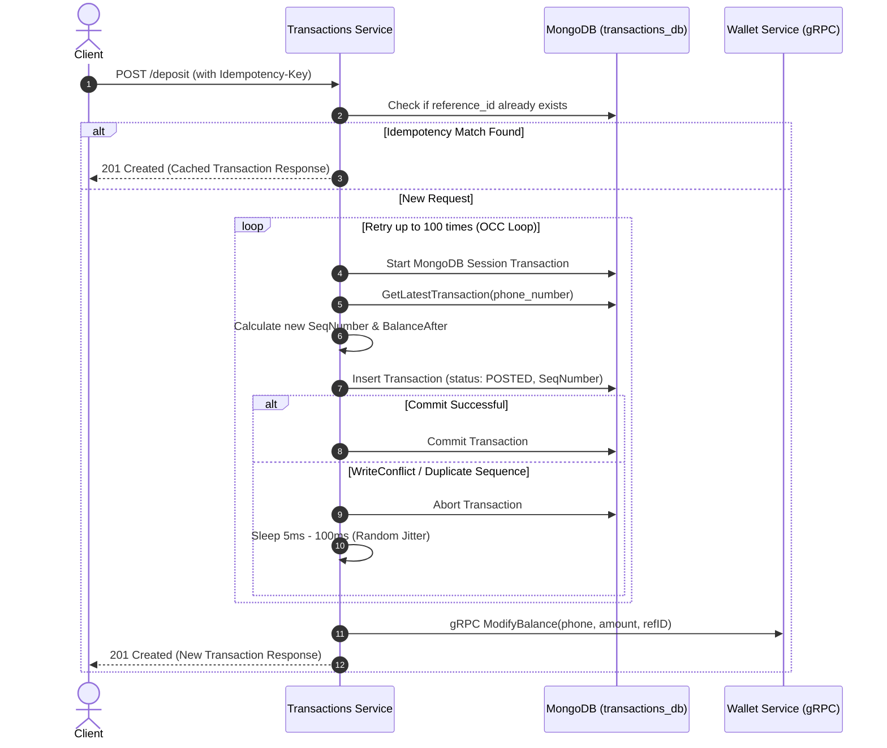

# 💸 Transactions Service (`svc-transactions`)

> **Status:** Active Microservice — High-throughput ledger engine, transaction orchestrator, and financial transaction manager for the Wallet & Transactions system.

---

## 📌 Overview

The **Transactions Service** is a mission-critical Go microservice responsible for orchestrating deposits, withdrawals, and wallet-to-wallet transfers. It serves as the authoritative immutable financial ledger of the system, maintaining sequential consistency, optimistic concurrency control, and idempotency guarantees across all monetary transactions.

Key capabilities:
- **Immutable Financial Ledger:** Every transaction creates a discrete, sequenced ledger entry with recorded `balance_before` and `balance_after`.
- **Optimistic Concurrency Control (OCC):** Prevents race conditions and dirty reads under high concurrency using wallet sequence numbers and automated randomized jitter retries.
- **Atomic Wallet-to-Wallet Transfers:** Executes atomic double-entry bookkeeping (sender debit + receiver credit) within MongoDB ACID sessions.
- **Strict Idempotency:** Guaranteed through mandatory `Idempotency-Key` headers backed by unique database indexes.
- **Inter-Service Synchronization:** Synchronizes balances with the **Wallet Service** over **gRPC** using shared protobuf contracts.
- **Event-Driven Change Data Capture (CDC):** Integrates with **Kafka Connect** to publish `POSTED` transaction events to Kafka for downstream consumers (e.g. `Notifications Service`).
- **Distributed Observability:** Full OpenTelemetry tracing (`otelhttp`, `otelgrpc`) and structured logging with Zerolog.

---

## 🏗 Architecture

```
svc-transactions/
├── cmd/
│   └── main.go                     # Service bootstrap, gRPC client connection, & graceful shutdown
├── api/
│   ├── rest/                       # HTTP Delivery Layer
│   │   ├── routes.go               # REST route definitions & Swagger UI handler
│   │   ├── controller.go           # TransactionsController struct
│   │   └── request_response_handler.go # HTTP request binding, validation, & header handling
├── client/
│   ├── wallet/                     # gRPC Client for Wallet Service
│   │   └── wallet_client.go        # Implements WalletClient interface (ModifyBalance, GetWallet)
│   └── notifications/              # Prepared gRPC client for Notifications Service
│       └── notifications_client.go
├── internal/
│   └── transactions/               # Core Domain Layer
│       ├── model.go                # Transaction schema, types, statuses, & domain errors
│       ├── dto.go                  # Request & response payloads, validation logic
│       ├── repository.go           # Database & client interface contracts
│       └── service.go              # Business logic: Deposit, Withdraw, Transfer, & retry loops
├── external/
│   ├── mongodb/                    # Infrastructure Layer (Data Access)
│   │   ├── connection.go           # MongoDB client connection setup
│   │   ├── repo.go                 # MongoDB repository (compound indexes, coupled inserts)
│   │   └── tx_manager.go           # Multi-document ACID session transaction manager
│   └── kafka/                      # Kafka Producer (prepared for direct publishing)
│       └── producer/
│           └── producer.go
├── util/
│   ├── common/                     # Validation helpers (phone number Egyptian regex)
│   ├── logger/                     # Zerolog structured logger with trace injection
│   └── tracer/                     # OpenTelemetry tracer configuration
├── tests/
│   ├── acid_test.go                # Rigorous ACID & high-concurrency integration test suite
│   ├── acid_test_docs.md           # Comprehensive test documentation & balance verification tables
│   └── run_tests.ps1               # PowerShell test automation runner
├── FlowCharts/                     # Architectural SVG diagrams
│   ├── Deposit-WithdrawLogic.svg
│   ├── TransactionService.svg
│   └── TransferLogic.svg
├── docs/                           # Swagger/OpenAPI documentation files
├── Dockerfile                      # Multi-stage Alpine Docker build
└── go.mod
```

### Clean Architecture Layers

| Layer | Package | Responsibility |
|-------|---------|----------------|
| **Transport** | `api/rest` | Validates HTTP payloads and `Idempotency-Key` headers, delegates to domain service, maps domain errors to standard HTTP status codes. |
| **Domain** | `internal/transactions` | Implements financial business logic, ledger sequencing, overdraft checks, retry loops, and interface definitions. Independent of database drivers. |
| **Infrastructure** | `external/mongodb` | Executes MongoDB queries, enforces compound unique indexes, and runs multi-document ACID transactions. |
| **Client** | `client/wallet` | gRPC client calling `WalletService` methods (`ModifyBalance`, `GetWallet`), mapping gRPC status codes to domain errors. |
| **Utilities** | `util/common`, `util/logger`, `util/tracer` | Cross-cutting phone validation, structured logging, and OpenTelemetry trace propagation. |

---

## ⚙️ How It Works Under the Hood

### 1. Sequence-Based Ledger & Optimistic Concurrency Control (OCC)
Each wallet maintains a strictly increasing, gap-free sequence of ledger transactions:
1. When a transaction request arrives, the service fetches the latest transaction for that phone number ordered by `sequence_number` descending:
   - If no prior transaction exists: `SeqNumber = 1`, `BalanceBefore = 0`.
   - If prior transactions exist: `SeqNumber = latestTX.SeqNumber + 1`, `BalanceBefore = latestTX.BalanceAfter`.
2. Computes `BalanceAfter = BalanceBefore ± Amount`.
3. Validates business constraints:
   - Withdrawals/Transfers: `BalanceBefore - Amount >= 0` (no overdraft).
   - Deposits/Transfers: `BalanceBefore + Amount <= WalletMax` ($9 \times 10^{15}$).
4. Inserts an immutable transaction document with status `POSTED` inside a MongoDB transaction (`txManager.WithTransaction`).
5. **Handling Concurrency Conflicts:**
   - A compound unique index on `{ "phone_number": 1, "sequence_number": -1 }` guarantees that no two transactions can claim the same sequence number for a given wallet.
   - If 20 simultaneous requests hit the same wallet, MongoDB grants the write to one transaction while the other 19 fail with a `WriteConflict` / duplicate key error.
   - The Go service intercepts this error (`ErrDuplicateSequence`), applies a randomized backoff jitter (`5ms + rand(96ms)`), and retries up to 100 times.



### 2. Double-Entry Transfer Flow (Coupled Transaction)
When executing a wallet-to-wallet transfer via `POST /v1/transactions/transfer`:
1. Validates that `SenderPhoneNumber != ReceiverPhoneNumber`.
2. Fetches latest ledger records for both sender and receiver to determine next sequence numbers and balances.
3. Within a single MongoDB ACID transaction session:
   - Prepares **Sender Withdrawal Transaction**:
     - `Type = TRANSFER`, `PhoneNumber = SenderPhone`, `Amount = Amount`, `Status = POSTED`
     - `ReferenceID = refID`
   - Prepares **Receiver Deposit Transaction**:
     - `Type = TRANSFER`, `PhoneNumber = ReceiverPhone`, `Amount = Amount`, `Status = POSTED`
     - `ReferenceID = refID + "_deposit"`
   - Atomically inserts both records via `CreateCoupledTransaction` (`InsertMany`).
4. **All-or-Nothing Guarantee:** If the receiver would exceed maximum wallet capacity, the entire MongoDB transaction aborts. A separate `FAILED` transaction record is recorded for the sender to maintain an audit trail, returning `422 Unprocessable Entity`.

### 3. Change Data Capture (CDC) via Kafka Connect
- Rather than coupling the core transaction execution with message broker availability, transactions are written to MongoDB first.
- The **Kafka Connect MongoDB Source Connector** (`mongo-source.properties`) monitors the MongoDB change stream:
  - Filters for: `operationType: insert` and `fullDocument.status: POSTED`.
  - Publishes events to Kafka topic: `transactions_db.transactions`.
  - Partition key: `wallet_id` (guaranteeing in-order event delivery per wallet).
- Downstream services (such as `Notifications Service`) consume from this topic asynchronously.

---

## 📡 API Endpoints

All transaction write operations require the `Idempotency-Key` HTTP header.

| Method | Path | Description | Required Headers | Status Codes |
|--------|------|-------------|------------------|--------------|
| `POST` | `/v1/transactions/deposit` | Credit funds to a wallet | `Idempotency-Key: <unique-uuid>` | `201`, `400`, `404`, `429`, `500` |
| `POST` | `/v1/transactions/withdraw` | Debit funds from a wallet | `Idempotency-Key: <unique-uuid>` | `201`, `400`, `404`, `429`, `500` |
| `POST` | `/v1/transactions/transfer` | Transfer funds between two wallets | `Idempotency-Key: <unique-uuid>` | `201`, `400`, `404`, `422`, `429`, `500` |
| `GET` | `/v1/swagger/` | Interactive Swagger API documentation UI | — | `200` |

### Request & Response Examples

#### 1. Deposit (`POST /v1/transactions/deposit`)
**Headers:** `Idempotency-Key: dep-98765-abc`  
**Request:**
```json
{
  "phone_number": "+201012345678",
  "amount": 5000
}
```
**Response (`201 Created`):**
```json
{
  "transaction_id": "6701a350c4d5e6f7a8b9c0d3",
  "wallet_id": "6701a2b3c4d5e6f7a8b9c0d1",
  "balance": 5000,
  "created_at": "2026-09-06T10:02:00Z",
  "status": "POSTED"
}
```

#### 2. Transfer (`POST /v1/transactions/transfer`)
**Headers:** `Idempotency-Key: trf-55443-xyz`  
**Request:**
```json
{
  "sender_phone": "+201012345678",
  "receiver_phone": "+201198765432",
  "amount": 1500
}
```
**Response (`201 Created`):**
```json
{
  "transaction_id": "6701a390c4d5e6f7a8b9c0d4",
  "sender_wallet_id": "6701a2b3c4d5e6f7a8b9c0d1",
  "status": "POSTED",
  "sender_balance_before": 5000,
  "sender_balance_after": 3500
}
```

---

## 🗄 Data Model (`transactions` collection)

```json
{
  "_id": {"$oid": "6701a350c4d5e6f7a8b9c0d3"},
  "reference_id": "dep-98765-abc",
  "associated_ref": "",
  "phone_number": "+201012345678",
  "sender_phone": "",
  "receiver_phone": "",
  "type": "DEPOSIT",
  "status": "POSTED",
  "amount": 5000,
  "wallet_id": "6701a2b3c4d5e6f7a8b9c0d1",
  "balance_before": 0,
  "balance_after": 5000,
  "sequence_number": 1,
  "failed_reason": "",
  "created_at": "2026-09-06T10:02:00Z"
}
```

### Database Indexes

| Index Name | Keys | Properties | Purpose |
|------------|------|------------|---------|
| `unique_wallet_sequence` | `{"phone_number": 1, "sequence_number": -1}` | `Unique: true` | Serializes operations per wallet and guarantees monotonic sequence order. |
| `unique_reference` | `{"reference_id": 1}` | `Unique: true` | Prevents duplicate transaction execution (Idempotency guarantee). |

---

## 🚀 Getting Started

### Prerequisites
- **Go 1.22+** (Go 1.26 toolchain)
- **MongoDB** Replica Set (required for multi-document ACID transactions)
- **Wallet Service** running with gRPC exposed (port `50051`)

### Configuration (`.ENV`)

Create `.ENV` in `svc-transactions/`:

```env
SERVER_PORT=8080
MONGO_URI=mongodb://localhost:27017/?replicaSet=rs0
MONGO_DB_NAME=transactions_db
WALLET_GRPC_URL=localhost:50051
```

| Variable | Required | Default | Description |
|----------|:--------:|:-------:|-------------|
| `MONGO_URI` | ✅ | — | MongoDB replica set connection URI |
| `MONGO_DB_NAME` | ❌ | `transactions_db` | Database name for transaction records |
| `SERVER_PORT` | ❌ | `8080` | HTTP REST server port |
| `WALLET_GRPC_URL` | ❌ | `localhost:50051` | gRPC address of the Wallet Service |

### Run Locally

```bash
cd Transactions-Service/svc-transactions
go run ./cmd
```

### Run with Docker

```bash
cd Transactions-Service/svc-transactions
docker build -t svc-transactions .
docker run -p 8080:8080 \
  -e MONGO_URI="mongodb+srv://<user>:<password>@cluster.mongodb.net" \
  -e MONGO_DB_NAME="transactions_db" \
  -e WALLET_GRPC_URL="wallet:50051" \
  svc-transactions
```

---

## 🧪 ACID & Concurrency Testing

The repository contains an exhaustive integration test suite (`acid_test.go`) validating:
- **Atomicity:** Partial operations roll back completely.
- **Consistency:** Balance math remains 100% accurate under mixed deposit/withdraw/transfer operations.
- **Isolation:** 20–50 simultaneous concurrent requests per wallet resolve cleanly via OCC retry loop without race conditions or lost updates.
- **Durability:** Repeated requests with the same `Idempotency-Key` return identical responses without duplicate balance mutations.

```bash
cd Transactions-Service/svc-transactions
go test -v -tags=integration -count=1 ./tests/
```

*For comprehensive test flow breakdowns and database ledger validation tables, see [acid_test_docs.md](tests/acid_test_docs.md).*

---

## ⚠️ Domain Errors

| Domain Error | Meaning | HTTP Status |
|--------------|---------|:-----------:|
| `wallet not found` | Target wallet is not registered in the system | `404 Not Found` |
| `insufficient balance for the requested operation` | Withdrawal/Transfer exceeds current balance | `400 Bad Request` |
| `deposit exceeds maximum wallet capacity` | Transaction would exceed theoretical limit | `400 Bad Request` |
| `invalid transaction status` | Sender and receiver phone numbers are identical | `400 Bad Request` |
| `Receiver could not accept the transfer` | Receiver wallet reached max limit; transfer aborted | `422 Unprocessable Entity` |
| `high frequency of transactions detected...` | Exceeded 100 retries due to extreme contention | `429 Too Many Requests` |
