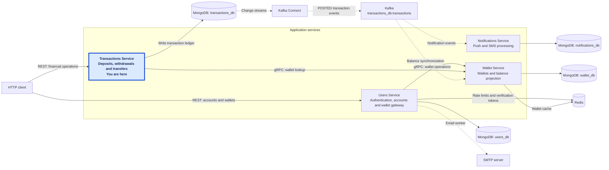
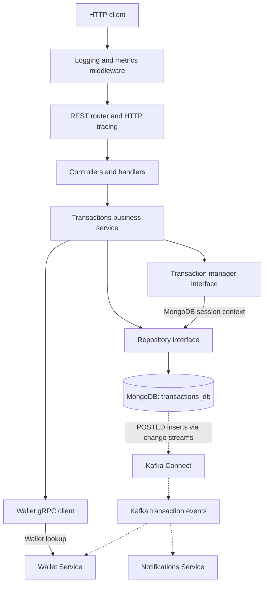

## Wallet & Transactions: system at a glance

This service is part of a larger system for user accounts, wallets, financial transactions, and notifications. **Transactions Service is highlighted below because you are reading its README.**


```mermaid
flowchart LR
    Client[HTTP client]

    subgraph Services[Application services]
        Users["Users Service<br/>Authentication, accounts and wallet gateway"]
        Wallet["Wallet Service<br/>Wallets and balance projection"]
        Transactions["<b>Transactions Service</b><br/>Deposits, withdrawals and transfers<br/>You are here"]
        Notifications["Notifications Service<br/>Push and SMS processing"]
    end

    Client -->|REST: accounts and wallets| Users
    Client -->|REST: financial operations| Transactions
    Users -->|gRPC: wallet operations| Wallet
    Transactions -->|gRPC: wallet lookup| Wallet

    Users --> UsersDB[(MongoDB: users_db)]
    Users -->|Rate limits and verification tokens| Redis[(Redis)]
    Users -.->|Email worker| SMTP[SMTP server]
    Wallet --> WalletDB[(MongoDB: wallet_db)]
    Wallet -->|Wallet cache| Redis
    Transactions -->|Write transaction ledger| TransactionsDB[(MongoDB: transactions_db)]
    Notifications --> NotificationsDB[(MongoDB: notifications_db)]

    TransactionsDB -.->|Change streams| Connect[Kafka Connect]
    Connect -.->|POSTED transaction events| Kafka["Kafka<br/>transactions_db.transactions"]
    Kafka -.->|Balance synchronization| Wallet
    Kafka -.->|Notification events| Notifications

    classDef currentService fill:#dbeafe,stroke:#1d4ed8,stroke-width:4px,color:#172554,font-weight:bold;
    class Transactions currentService;
```

Solid arrows show requests and data access; dashed arrows show asynchronous processing. Each service owns its MongoDB database. Users handles authentication and account management, delegates wallet operations to Wallet, and sends verification emails through its background worker. Transactions owns the financial ledger; its committed records feed wallet balance synchronization and notification processing through Kafka Connect and Kafka.

The shared monitoring stack uses Prometheus and Grafana for metrics and Jaeger for traces. See the root [`docker-compose.yml`](../docker-compose.yml) for how the system is connected, or explore the [Users](../Users-Service/README.md), [Wallet](../Wallet-Service/README.md), and [Notifications](../Notifications-Service/README.md) service READMEs.

---

# Transactions Service (`svc-transactions`)

A service in the Wallet & Transactions project for deposits, withdrawals, and wallet-to-wallet transfers. Its MongoDB ledger is the source of truth for financial balances.

**Status: work in progress.** REST operations, ledger sequencing, idempotency checks, MongoDB transactions, and CDC integration are implemented. Wallet balances and Notifications are updated asynchronously. Remaining integration and reliability limitations are documented below.

## Responsibilities

- Accept deposit, withdrawal, and transfer requests over HTTP.
- Require an `Idempotency-Key` and reuse recorded transaction results on replay.
- Calculate balances from the latest ledger entry for each phone number.
- Enforce positive amounts, sufficient funds, and maximum wallet capacity.
- Assign ledger sequence numbers and retry conflicting inserts.
- Commit both transfer legs inside one MongoDB transaction.
- Write records that Kafka Connect publishes to Wallet and Notifications.
- Record HTTP request logs, metrics, and distributed tracing.

The service owns the `transactions` collection in `transactions_db`. Wallet owns wallet accounts and a balance projection; Users owns authentication and account management. Transactions currently does not publish directly to Kafka or call Notifications.

## Architecture


```mermaid
flowchart TD
    Client[HTTP client] --> Middleware[Logging and metrics middleware]
    Middleware --> Routes[REST router and HTTP tracing]
    Routes --> Handlers[Controllers and handlers]
    Handlers --> Service[Transactions business service]
    Service --> WalletClient[Wallet gRPC client]
    WalletClient -->|Wallet lookup| Wallet[Wallet Service]
    Service --> TxManager[Transaction manager interface]
    Service --> Repo[Repository interface]
    TxManager -->|MongoDB session context| Repo
    Repo --> Mongo[(MongoDB: transactions_db)]
    Mongo -.->|POSTED inserts via change streams| Connect[Kafka Connect]
    Connect -.-> Kafka[Kafka transaction events]
    Kafka -.-> Wallet
    Kafka -.-> Notifications[Notifications Service]
```

### Layers and dependencies

| Layer | Location | Responsibility |
|---|---|---|
| Startup | `cmd/` | Load configuration, connect MongoDB and the Wallet client, wire components, start HTTP, handle shutdown. |
| HTTP transport | `api/rest/` | Register routes, decode JSON, validate headers/phones/amounts, map errors, log requests, expose metrics. |
| Business logic | `internal/transactions/` | Idempotency, ledger balance calculations, sequence retries, deposit/withdrawal/transfer orchestration, and interfaces. |
| Persistence | `external/mongodb/repo.go` | Create indexes, find existing/latest transactions, insert individual or coupled records. |
| Transaction manager | `external/mongodb/tx_manager.go` | Execute callbacks with a MongoDB session transaction. |
| Service client | `client/wallet/` | Call Wallet over gRPC and map its responses/errors to local DTOs. |
| Retained integrations | `client/notifications/`, `external/kafka/producer/` | Earlier direct-RPC/producer paths; not wired into startup. |
| Utilities | `util/` | Phone validation, logging, metrics, and tracing setup. |

Repository, wallet-client, and transaction-manager interfaces separate business operations from their implementations. Financial balances are computed from the ledger rather than the asynchronously updated Wallet balance.

### Request pipeline

```text
RequestLogger -> MetricsMiddleware -> Router -> HTTP tracing wrapper
    -> Handler: header, JSON, amount and phone validation
    -> Service: replay check, ledger rules and retries
    -> MongoDB transaction -> HTTP response
After commit: MongoDB change stream -> Kafka Connect -> Kafka -> Wallet / Notifications
```

No JWT authentication, wallet-ownership middleware, or request rate limiter is wired into these routes. The `429` response represents exhausted transaction-conflict retries.

## Files

```text
Transactions-Service/
|-- README.md
|-- .github/workflows/ci.yml          # Build and package tests
`-- svc-transactions/
    |-- cmd/main.go                  # Configuration, dependencies, HTTP server, shutdown
    |-- api/rest/
    |   |-- routes.go                # Financial routes, Swagger, metrics, HTTP tracing
    |   |-- controller.go
    |   |-- request_response_handler.go # Header/payload validation and HTTP responses
    |   `-- middleware.go            # Request logging and metrics
    |-- internal/transactions/
    |   |-- model.go                 # Ledger schema, types, statuses, errors, capacity
    |   |-- dto.go                   # HTTP and service-client DTOs
    |   |-- repository.go            # Persistence interface
    |   `-- service.go               # Ledger operations, client/manager interfaces, retries
    |-- external/
    |   |-- mongodb/
    |   |   |-- connection.go
    |   |   |-- repo.go              # Indexes, replay/latest queries, inserts
    |   |   `-- tx_manager.go        # MongoDB session transactions
    |   `-- kafka/producer/producer.go # Retained direct publisher; not active
    |-- client/
    |   |-- wallet/wallet_client.go
    |   `-- notifications/notifications_client.go # Retained earlier integration
    |-- util/                        # common/, logger/, metrics/, tracer/
    |-- tests/
    |   |-- acid_test.go             # Historical integration-tagged live-stack suite
    |   |-- observation.go           # Integration test observation helpers
    |   |-- acid_test_docs.md
    |   `-- run_tests.ps1
    |-- docs/                        # Generated Swagger Go/JSON/YAML files
    |-- Dockerfile
    |-- go.mod / go.sum
    |-- .ENV.example
    |-- .air.toml / .golangci.yml
    `-- .dockerignore / .gitignore
```

Shared wallet RPCs live in [`../Contracts/wallet/v1/wallet.proto`](../Contracts/wallet/v1/wallet.proto). The root [`docker-compose.yml`](../docker-compose.yml) wires the services; [Kafka Connect](../kafka-connect/README.md) documents CDC configuration.

## Main flows

### Deposits and withdrawals

1. Require a nonempty `Idempotency-Key`, decode JSON with unknown fields rejected, and validate the amount and phone number.
2. Query for a recorded result and existing ledger history. A replay returns the stored result without a new balance mutation.
3. If there is no history, a deposit looks up the wallet over gRPC and starts at balance `0`. A first withdrawal checks wallet existence and then fails for insufficient funds.
4. Inside a MongoDB transaction, read the latest ledger record, calculate the next sequence number and balance, and enforce capacity or sufficient funds.
5. Insert a `POSTED` record and return the committed balance.
6. On a sequence conflict, sleep a random **0–30ms** and retry. The service loop permits **100 attempts**; exhaustion returns `429`.

The compound unique index on phone number and sequence number prevents two records from taking the same sequence. A duplicate reference triggers lookup of the existing record. MongoDB's session transaction helper also handles its own driver-level transaction retries.

### Wallet-to-wallet transfers

1. Reject identical sender and receiver phone numbers and check for a replay.
2. Require prior sender ledger history; a sender with no recorded funds fails for insufficient balance.
3. Resolve the receiver's wallet via gRPC if it has no ledger history.
4. In one MongoDB transaction, read both current ledger states, check funds/capacity, and insert two `TRANSFER` records.
5. The sender uses the supplied reference; the receiver uses `<reference>_deposit`. Each leg has its own wallet, sequence, and before/after balances.
6. Return the sender's transaction ID and balances after commit.

If the receiver exceeds capacity, the transfer transaction aborts. A separate sender `FAILED` record is then attempted with unchanged balance, an incremented sequence, and the same reference. Successful failure recording returns `422`; a replay of that failed transfer also returns `422`. Other failures can return their mapped domain error or `500`.

The atomic boundary covers the two ledger inserts. Wallet projection updates and notification processing occur later and are not part of that MongoDB transaction.

### Change data capture

Kafka Connect reads `transactions_db.transactions` and filters new inserts to `status: POSTED`. Its initial snapshot also selects existing posted records. The connector publishes full documents to `transactions_db.transactions`, keyed by `wallet_id`, and removes fields including `reference_id`, `balance_before`, `status`, and `sequence_number` from streamed events.

Wallet uses the event's `balance_after` to synchronize its projection; Notifications creates push/SMS records. A successful HTTP response does not wait for either consumer, and failed ledger records are excluded from the configured CDC stream.

## Data and validation

| Collection | Main fields | Indexes |
|---|---|---|
| `transactions` | `_id`, `reference_id`, optional `associated_ref`, `phone_number`, optional `sender_phone` / `receiver_phone`, `type`, `status`, `amount`, `wallet_id`, `balance_before`, `balance_after`, `sequence_number`, optional `failed_reason`, `created_at` | Unique `unique_wallet_sequence` on `phone_number` + descending `sequence_number`; unique `unique_reference` on `reference_id`. |

- Transaction types are `DEPOSIT`, `WITHDRAWAL`, and `TRANSFER`; statuses are `POSTED` and `FAILED`.
- Amounts and balances use `int64`. Requests require a positive integer amount.
- Maximum balance is **9000000000000000**. The API does not define a separate currency or monetary-unit field; use a consistent integer unit throughout the project.
- Mobile numbers contain 11 digits and start with `010`, `011`, `012`, or `015`; surrounding whitespace is trimmed. International `+20...` payloads are not accepted.
- `Idempotency-Key` must be nonempty; a UUID is not required. The unique index spans the whole collection, including receiver transfer references.
- Replays do not compare the original payload or operation with the new request. Use a new key for each distinct operation and keep it unchanged only when retrying that operation.
- Balance history and sequencing are keyed by phone number. Existing history supplies the wallet ID without checking Wallet again.
- `associated_ref` exists in the model but is not populated by the current transfer flow.

Example committed deposit record:

```json
{
  "_id": {"$oid": "6701a350c4d5e6f7a8b9c0d3"},
  "reference_id": "dep-example-001",
  "phone_number": "01012345678",
  "type": "DEPOSIT",
  "status": "POSTED",
  "amount": 5000,
  "wallet_id": "6701a2b3c4d5e6f7a8b9c0d1",
  "balance_before": 0,
  "balance_after": 5000,
  "sequence_number": 1,
  "created_at": "2026-09-06T10:02:00Z"
}
```

## REST endpoints

The default base URL is `http://localhost:8080`. All financial writes require:

```http
Content-Type: application/json
Idempotency-Key: <unique-operation-reference>
```

### Financial operations

| Method | Path | Input | Success |
|---|---|---|---|
| POST | `/v1/transactions/deposit` | `phone_number`, `amount` | `201`: `transaction_id`, `wallet_id`, `status`, `balance`, `created_at` |
| POST | `/v1/transactions/withdraw` | `phone_number`, `amount` | `201`: same response fields as deposit |
| POST | `/v1/transactions/transfer` | `sender_phone`, `receiver_phone`, `amount` | `201`: `transaction_id`, `sender_wallet_id`, `status`, `balance_before`, `balance_after` |

Successful replay also returns `201`. The transfer response describes the sender; it does not include the receiver's resulting balance.

### Documentation and metrics

| Method | Path | Purpose |
|---|---|---|
| GET | `/v1/swagger/` | Swagger UI and generated specification at `/v1/swagger/doc.json` |
| GET | `/metrics` | Prometheus HTTP metrics |

No dedicated health or ledger-query HTTP endpoint is registered.

### Example payloads

Deposit or withdrawal:

```json
{
  "phone_number": "01012345678",
  "amount": 5000
}
```

Deposit response:

```json
{
  "transaction_id": "6701a350c4d5e6f7a8b9c0d3",
  "wallet_id": "6701a2b3c4d5e6f7a8b9c0d1",
  "status": "POSTED",
  "balance": 5000,
  "created_at": "2026-09-06T10:02:00Z"
}
```

Transfer, using a new idempotency key:

```json
{
  "sender_phone": "01012345678",
  "receiver_phone": "01198765432",
  "amount": 1500
}
```

Transfer response for a sender previously holding 5000:

```json
{
  "transaction_id": "6701a390c4d5e6f7a8b9c0d4",
  "sender_wallet_id": "6701a2b3c4d5e6f7a8b9c0d1",
  "status": "POSTED",
  "balance_before": 5000,
  "balance_after": 3500
}
```

### Error responses

Errors use the shape `{"error":"message"}`.

| Status | Current mapping |
|---|---|
| `400` | Missing idempotency key, malformed/unknown JSON fields, invalid phone, nonpositive amount, identical transfer phones, insufficient funds, or mapped capacity errors. |
| `404` | Wallet lookup returns wallet not found. |
| `405` | Unsupported method for a registered route. |
| `422` | Receiver-capacity failure recorded as a failed transfer, or replay of that failed transfer. |
| `429` | Transaction-conflict attempts exhausted. |
| `500` | Unexpected database/client failures; normal handler errors hide dependency details. |

## Logging, metrics, and tracing

Zerolog emits console logs by default and JSON/info logs when `APP_ENV=production` is present during initialization. HTTP completion logs record method, path, status, duration, byte counts, and request metadata. Zerolog's default duration unit is milliseconds.

The three financial routes use `otelhttp`, and the Wallet client uses `otelgrpc` for trace propagation. Context-aware logs include trace/span IDs when available. The repository and business service do not currently add their own operation spans. CDC events do not carry the original request's trace context.

`/metrics` exposes `http_requests_total`, `http_request_duration_seconds`, `http_request_bytes_read`, and `http_response_bytes_written`. A MongoDB duration metric is declared but is not observed by the repository.

Logging and tracing initialize before `.ENV` is loaded. Supply `APP_ENV` and `OTEL_EXPORTER_OTLP_ENDPOINT` in the process environment, including through Compose, when they must affect startup.

## Configuration and local development

The module declares Go **1.26.5**. Financial operations need MongoDB with transaction support, such as a replica set or Atlas, and the published Contracts dependency. Wallet gRPC is needed when resolving wallets without prior history; CDC validation also needs Kafka, Kafka Connect, Wallet, and Notifications.

| Variable | Default / requirement |
|---|---|
| `MONGO_URI` | Required. MongoDB connection URI with session-transaction support. |
| `MONGO_DB_NAME` | `transactions_db` |
| `SERVER_PORT` | `8080` |
| `WALLET_GRPC_URL` | `localhost:50051`; Compose overrides this to `wallet:50051`. |
| `APP_ENV` | `production` enables JSON/info logging; set before initialization. |
| `OTEL_EXPORTER_OTLP_ENDPOINT` | Optional host:port, e.g. `localhost:4318` or `jaeger:4318`; set before initialization for export. |

`NOTIFICATIONS_GRPC_URL` appears in the environment template and Compose, but the direct Notifications integration is disabled. No Kafka broker setting is required by Transactions itself; Kafka Connect handles publishing.

From this directory:

```powershell
cd svc-transactions
Copy-Item .ENV.example .ENV # First-time setup only; preserve an existing .ENV
# Set MongoDB and the reachable Wallet gRPC address.
go run ./cmd
```

MongoDB is connected and indexes are created at startup. Constructing the Wallet gRPC client does not prove that Wallet is reachable.

From the workspace root, after configuring the service `.ENV` files and connector:

```powershell
docker compose build transactions
docker compose up -d
```

The root [Compose file](../docker-compose.yml) is the authoritative full-stack configuration. It includes Users, Wallet, Transactions, Notifications, Kafka, Connect, Redis, Jaeger, Prometheus, and Grafana.

### Current integration limits

- Wallet and Notifications lag committed ledger records. Use the Transactions response to inspect the synchronous result, then verify consumer convergence separately.
- The REST API has no wired authentication or ownership checks. Users JWTs are not validated by Transactions.
- Ledger history uses phone numbers and may outlive a deleted wallet. Recreating a wallet with the same number does not reset that history or automatically update its stored wallet ID.
- Idempotency references are global and payload consistency is not checked on replay. Avoid reuse across operations, phones, or transfer receiver suffixes.
- Tagged integration tests still create/read wallets through the disabled Wallet HTTP routes on port 8000.
- Kafka Connect filters failed records out; a failed transfer does not generate a posted transaction notification.

## Deferred issues to revisit

These items are documented follow-up work, not implemented fixes.

- [ ] **Bind replay to the original operation.** Validate the phone, operation, and amount associated with a reused key, and define the receiver-reference namespace.
- [ ] **Enforce authenticated financial ownership.** Define how Users authentication and wallet ownership apply to transaction writes.
- [ ] **Coordinate ledger identity with wallet lifecycle.** Handle deletion and phone reuse without attaching new wallets to old history.
- [ ] **Complete dependency observability.** Add meaningful service/repository spans and record MongoDB metric observations.
- [ ] **Align startup configuration order.** Load local configuration before logging and tracing initialize.
- [ ] **Migrate live-stack tests.** Create/read wallets through Users REST or Wallet gRPC and retain ledger and CDC convergence assertions.

## Verification

From `svc-transactions`:

```powershell
go build ./...
go test ./...
```

CI runs dependency download, build, and package tests with Go 1.26.5. Plain package tests exclude the live-stack suite.

| File | Purpose |
|---|---|
| `svc-transactions/tests/acid_test.go` | Integration-tagged atomicity, balance consistency, concurrent operations, replay, and CDC convergence scenarios. |
| `svc-transactions/tests/observation.go` | Record request/convergence observations for that suite. |
| [`svc-transactions/tests/acid_test_docs.md`](svc-transactions/tests/acid_test_docs.md) | Scenario descriptions and ledger/balance verification tables. |
| `svc-transactions/tests/run_tests.ps1` | Retained integration runner. |

The suite's retained command is:

```powershell
go test -v -tags=integration -count=1 -timeout 600s ./tests/
```

It currently targets disabled Wallet REST routes and is not a working verification path for the default deployment. After migrating its wallet helpers, end-to-end validation should compare committed ledger results, test both transfer legs and replays, and poll Wallet until the CDC projection catches up. Run it only against an isolated development dataset.
